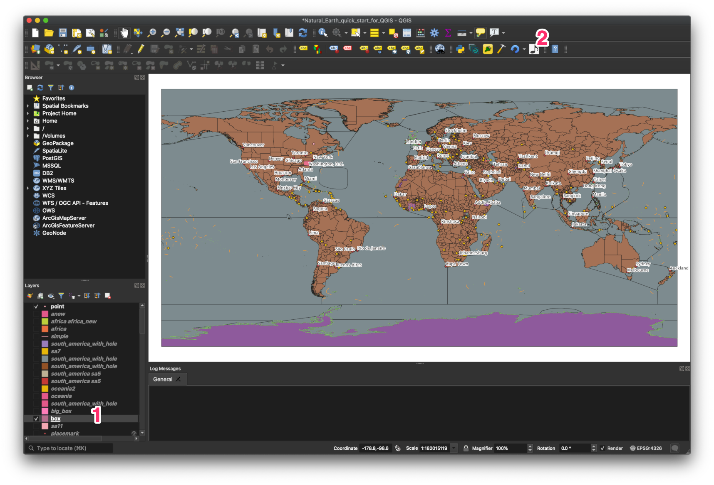
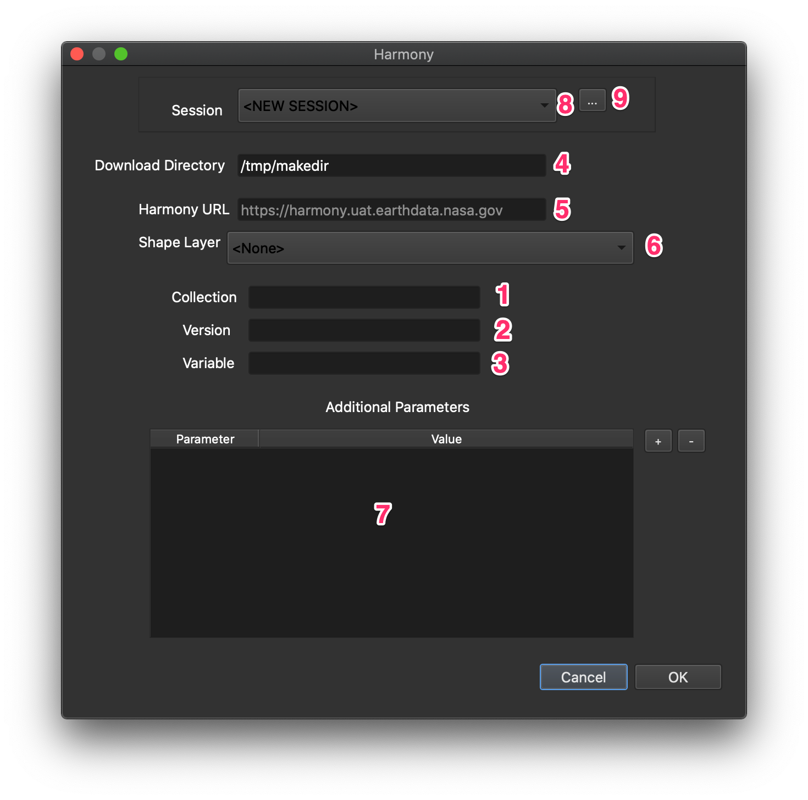
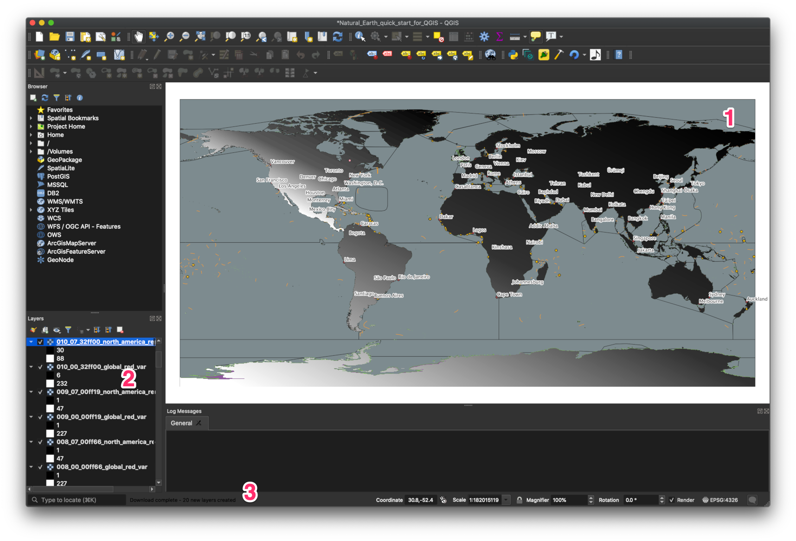
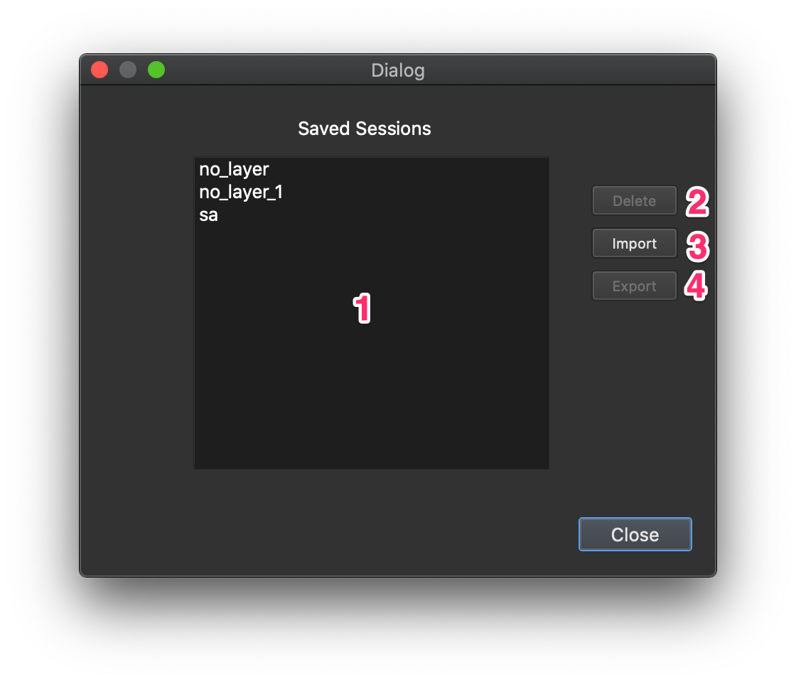

# Harmony QGIS

This plugin allows the user to select areas on the map and upload them as queries (along with other parameters) to the [Harmony](ssh://git@git.earthdata.nasa.gov:7999/hqgis/harmony-qgis.git) Earth science data/service broker, showing the results on the map.

## Requirements
QGIS version 3.12 or higher

## Installation
1. Clone this repository under the plugins directory for QGIS (/Users/USER_NAME/Library/Application Support/QGIS/QGIS3/profiles/default/python/plugins on a Mac)
```
$ git clone https://git.earthdata.nasa.gov/scm/hqgis/harmony-qgis.git
```
3. Restart QGIS
4. Select Plugins->Manage and Install Plugins from the menu
5. Click the check box next to the Harmony plugin

## Usage

The basic workflow begins as labeled in red numbers on figure 1:

1. (optional) select a layer in the layers panel. This will preselect the layer in the main dialog, but is not strictly necessary.
2. Click the Harmony plugin icon in the toolbar.

<figure>

<figcaption>Figure 1 - Using the plugin</figcaption>
</figure>

This will open the main dialog shown in figure 2.
Here you can configure a Harmony query by entering parameters in the relevant fields. At a minimum you must fill in the `Collection`, `Version`, and `Variable` fields in order to execute a query. 

As labeled in figure 2, these fields are

1. `collection` (required) Used to indicate the Common Metadata Repository (CMR) collection id to use
2. `version` (required) Used to indicate which version of the collection to use
3. `variable` (required) Used to indicate which variable to use
4. `download directory` Where to store the images downloaded from Harmony
5. `harmony url` The URL of the Harmony service to use (for accessing various environments such as UAT or Prod)
6. `shape layer` A selection box to choose a layer to be sent as a shapefile to indicate a sub-setting boundary with the Harmony query. This will be preselected if the layer was selected when the plugin icon was selected. **Note** it is not necessary to provide a layer to execute a query.
7. `additional parameters` This table can be used to add additional query parameters as key/value pairs. Consult the Harmony documentation for available parameters.
8. `session selector` This selector can be used to fill in the other fields from a previous session (see the 'Sessions' section below).
9. `session management` This button will bring up the sessions management dialog (Figure 3) to allow the user to delete, import, and export sessions.

<figure>

<figcaption>Figure 2 - The main dialog</figcaption>
</figure>

After filling in the query parameter fields and clicking `OK`, the plugin will send the query to Harmony and begin downloading any results (or present error messages in the case of failure). Image results are downloaded in the background to preserve responsiveness in the main UI. Results are downloaded as they become available (rather than all at once) and are rendered as raster layers. A progress bar is rendered in the status window at the bottom and updated as new results are downloaded.

Figure 3 shows the results of a query that generated 20 new layers. The layers are shown in the main map (1) with the new layers added to the layer panel (2). A text message indicating the number of new layers is shown in the status bar (3).

<figure>

<figcaption>Figure 3 - Displaying Harmony results</figcaption>
</figure>

### Sessions

Sessions are a way to save settings from the main dialog for later reuse. This is particularly useful when showing demos.

When the main dialog first opens, the `Session` selector is set to `<NEW SESSION>`. If the user fills in the dialog, doesn't change the `Session` selector, and then selects `OK`, a pop-up dialog will appear asking to save the settings as a session. If the user creates the new session, the name will appear in the `Session` selector in subsequent invocations. Choosing a session name from the selector populates the other fields in the dialog with the last saved settings.

The user can click on the session management button, (9) in figure 2, to bring up the sessions management dialog shown in figure 5.

<figure>

<figcaption>Figure 5 - The sessions management dialog</figcaption>
</figure>

All the saved sessions are shown in the list widget (1). Selecting one ore more (shift select) saved sessions will enable the `Delete` button (2). As the name suggests, this will delete the selected sessions. Selecting sessions will also enable the `Export` button (4)
which can be used to write out the data for one or more sessions as a JSON file. This can be shared with other users to allow them to reproduce the Harmony queries defined by sessions. Conversely, the `Import` button (3) can be used to load sessions from an exported file. 

**Note** the selected layer (if any) is saved as part of the session data. If an imported session contains a layer name that does not exist in the current project, this information is discarded.
